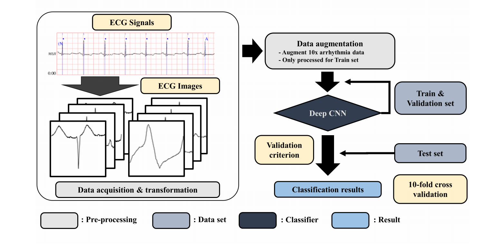
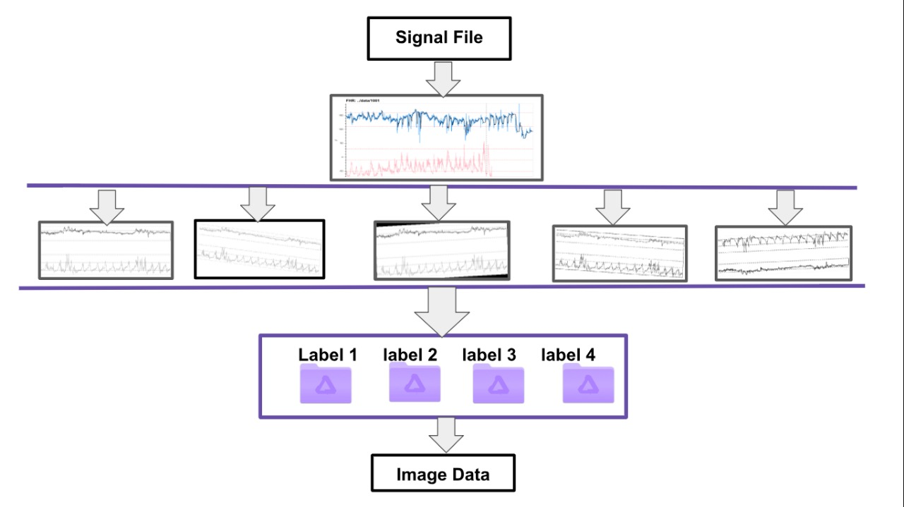
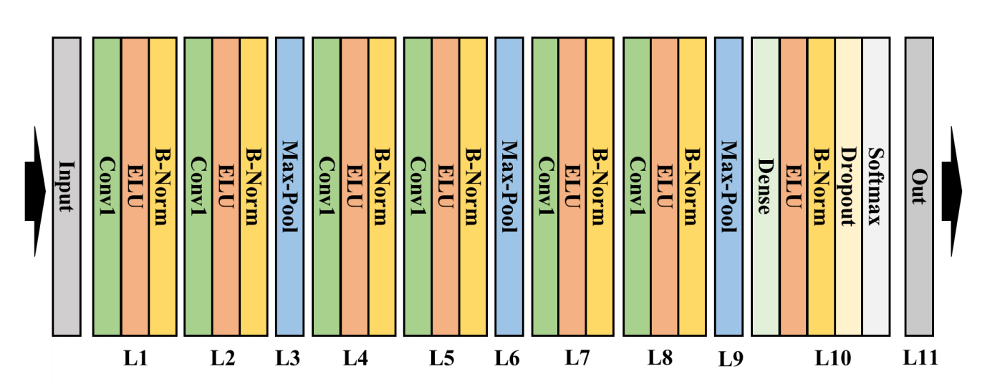

# Fetal Distress Classification

## Description
During the child birth doctor wants to know the status of the fetus for safe delivery. Fetal distress before and during childbirth indicating that the fetus has been receiving inadequate oxygen. Cardiotocography monitors two vital parameters, i.e Fetal heart rate (FHR) and uterine contractions (UC). These time series data and can be used to detect fetal distress. 

### Additional Info
[How I outperformed CTG Experts with 15 years of experience in 15 days!!](https://medium.com/@harmandeepsinghhds/how-i-outperformed-ctg-experts-with-15-years-of-experience-in-15-days-b848ae87655a?source=friends_link&sk=fb2d6ad0ab32224bd751ab497694bfb7)

## Goal
A system that takes these two time series data as inputs and classifies them as "Distress", "Suspicious" and "Normal". This project aims to automate the process of classification of FHR and UC signals to find status of fetal health with imporoved accuracy.

## Data Source
- Signal data from [The CTU-UHB Intrapartum Cardiotocography Database](https://physionet.org/physiobank/database/ctu-uhb-ctgdb/) .
- Labels from [Jiri Spilka - data](http://people.ciirc.cvut.cz/~spilkjir/data.html)
Data is available to us in continuous time-series format. The length of each signal is 19000 avg time stamps.

## Approach
In this project we have used 2-D CNN. [ECG arrhythmia classification using a 2-D convolutional neural network](https://arxiv.org/pdf/1804.06812.pdf)  paper has been used for network architecture implementation. 

### Reasons to use CNN 
1. This data available to us (552 records) is very less as compared to the deep learning standards. If we use RNN we cannot augment the data.We can perform a lot of data augmentation on images resulting in much more data.
2. Doctors solve this problem by visally analysing the signal. The aim of NN is to replicate the human mind's thinking process.  This approach is more similar to the way human experts interpret signals i.e looking at the graph rather than raw numbers.
3. We do not need to exract the features. This process of feature extraction would be performed by the neural network. If we extract features manually there would be a limit to the maximum features that we can extract and all the feature are not able to completely represent the image.

### Preprocessing:
1. UC has not been modified.
1. The maximum missing value in FHR is 53.50% and average is 18.78%. We can't delete any timestamp because deleting it would change the length of each signal. So instead of deletion the 0 values have been filled with rolling mean with a window of 100 previous timestamps.
2. We have also added mean of the cleaned signal of FHR on the FHR signal image.
3. From each sample we have prepared images each having 800 time stamps of data.

### Image Augmentation:
Each image has been augmented in 6 different ways.
The following augmentations have been applied:
- Random Rotation 
- Brightness + Rotation
- Contrast + Rotation
- Sharpness + Rotation

Note: We can't apply random crop because it may remove important data.

#### Total imgages generated:
About 1,44,000 images have been generated from 552 samples.

### Division of a single record and labelling:

Image:
Step1 and Step2 are taken by equally separating the area before Stage2 starting point into two parts.
Step3 is the remaining area after Stage2 starting point.

Note: Labels of Step1,2,3 have been taken from label file 
- `(pH > 7.15 for no hypoxia; 7.15 ≥ pH > 7.05 for mild hypoxia and pH ≤ 7.05 for severe hypoxia) ` where `(no hypoxia=1, mild hypoxia=2, severe hypoxia=3, uninterpretable=-1)`

## Model: 

The CNN has following architecture.
We are using 80% data for training and 20% data for testing(440+112). 
- Note: Image size plays a crucial role in accuracy.

## Test Time Augmentaion:
Instead of directly inputing the network with a single image, multiple augmentations of same image are evaluated and resulting label is mode of all augmented images.

## Doctor's Vs Model's Accuracy:
Panel of 9 experts each with atleast 15 years of experience is achieving 64.85% accuracy while our model is 70%+ accurate.

|Part	|Accuracy(%)|  	
|---	|---	    |
|  1 	|   70.00   | 
|  2	|   68.33	| 
|  3    |   73.33	|
